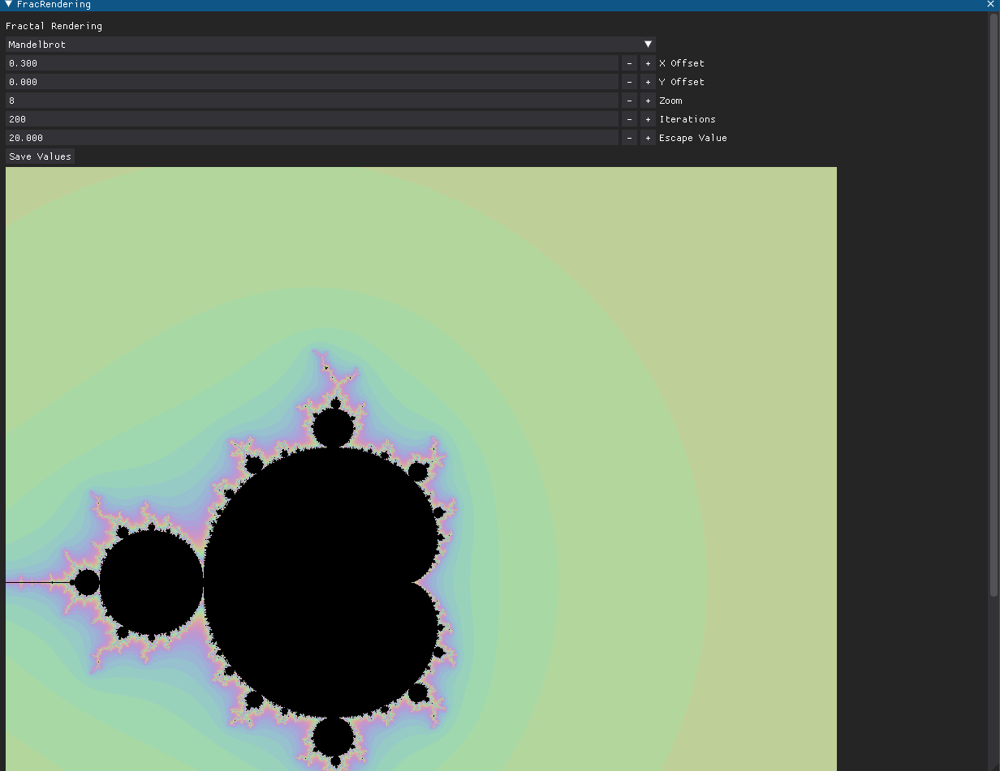
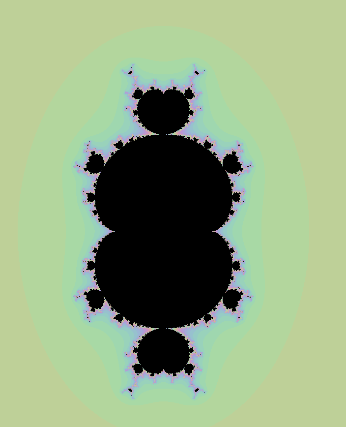
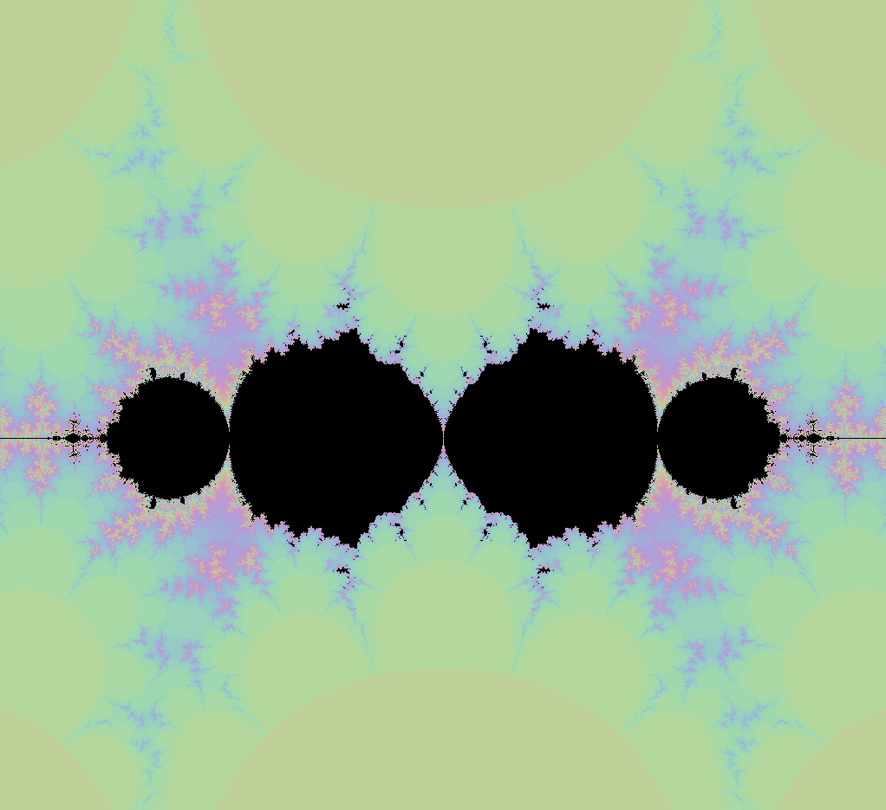

# Windows:

``` make
make
```

``` make
make run
```

# Linux:

Create a virtual environment.
``` bash
    python3 -m venv env
    ./env/bin/activate
```

Install the requirements:
``` bash
    pip install -Ur requirements.txt
```

Build the rust library:
```bash
    cd rust_generation
    maturin develop
    cd ..
```

Execute the program:
```bash
    ./python_rendering/main.py
```
